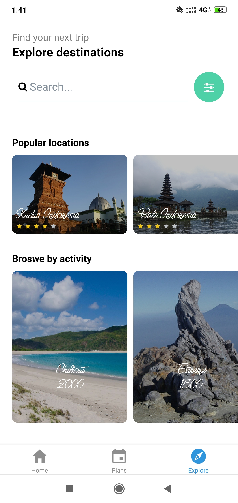
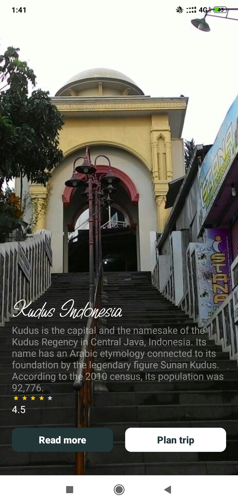

# travel-plan

[](https://reactnative.dev/)

[](https://travis-ci.org/joemccann/dillinger)


### Tech

Dillinger uses a number of open source projects to work properly:

* [Expo React Native Typescript Template] - Expo is an open-source platform for making universal native apps for Android, iOS, and the web with JavaScript and React.
* [React Navigation] - Routing and navigation for your React Native apps
* [React Native Element] - Cross Platform React Native UI Toolkit

### Installation

Install the dependencies and devDependencies and start the server.

```sh
$ cd travel-plan
$ npm install
$ npm start
```


### Source Image App





### Source Base Design by

*https://www.instagram.com/uisource/?igshid=1jib4zqad4xza
